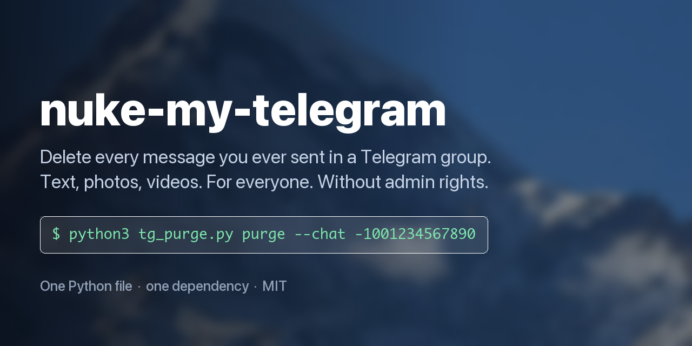

# nuke-my-telegram

**Delete all your own messages, photos and videos from a Telegram group — for everyone, without admin rights.**

Telegram lets admins wipe a user's entire history with one tap. It gives you, the member, nothing: you select 100 messages at a time, forever. This is the missing command.

```bash
git clone https://github.com/currentsundaymorning-hub/telegram-delete-all-my-messages
cd telegram-delete-all-my-messages
python3 -m venv .venv && source .venv/bin/activate && pip install -U "telethon==1.45.*"

python3 tg_purge.py list                        # log in, find the chat id
python3 tg_purge.py scan  --chat -1001234567890 # count only, deletes nothing
python3 tg_purge.py purge --chat -1001234567890 # delete, for everyone
```



## What a dry run looks like

```
$ python3 tg_purge.py scan --chat -1001234567890

Account: Jane (id=777000123)
Chat: Project Team [supergroup] id=-1001234567890
Messages scanned: 41209
Yours, matching the filters: 3874
By type: text 2951, photo 512, video 221, voice 118, file 72
Date range: 2019-03-14 … 2026-09-15
Skipped service messages (members cannot delete those): 6

That was a dry run (scan). Nothing was deleted.
```

## Get your API keys

The script talks to Telegram as **you**, so it needs your own API credentials. They are free and take a minute.

1. Open [my.telegram.org](https://my.telegram.org) in a normal browser — no VPN, no ad blocker, cookies on.
2. Enter your phone number in international format. **The login code arrives as a message inside Telegram, not by SMS.** If you have a cloud password (2FA), it asks for that next.
3. Click **API development tools**.
4. Fill in **App title** and **Short name** (5–32 latin characters). Leave the URL empty, set **Platform** to *Other*, then **Create application**.
5. Copy **App api_id** (a number) and **App api_hash** (32 hex characters).

One application per phone number, and there is no delete button — that is normal and fine.

```bash
export TG_API_ID=1234567
export TG_API_HASH=0123456789abcdef0123456789abcdef
```

These live only in the current shell. Skip this and the script will just ask.

**Your keys never leave your machine.** They go straight into Telethon and nowhere else — no config is uploaded, no telemetry, no network calls except MTProto to Telegram. Read [tg_purge.py](tg_purge.py) and check; that is why it is one short file.

## Full run, start to finish

```bash
# 1. log in and find the chat id (asks for phone, code and 2FA password the first time)
python3 tg_purge.py list

# 2. count what would go — deletes nothing
python3 tg_purge.py scan --chat -1001234567890

# 3. delete it — you confirm by typing the exact number of messages
python3 tg_purge.py purge --chat -1001234567890

# 4. verify: this should now report 0
python3 tg_purge.py scan --chat -1001234567890

# 5. clean up
python3 tg_purge.py logout
```

Supergroup ids start with `-100`; basic group ids are just negative. Step 1 creates `tg_purge.session` in the current directory — that file is a logged-in session, so keep it to yourself and run `logout` when you are done.

**Delete before you leave the group.** Once you are out you cannot delete anything (`CHANNEL_PRIVATE`), and out of a private group with no invite link it is permanent.

## Delete only photos and videos, keep the text

```bash
python3 tg_purge.py purge --chat -1001234567890 --media-only
```

`--media-only` keeps every text message and removes only photos, videos, GIFs and round video messages. Combine it with a date cut-off and a backup of the text you are about to lose:

```bash
python3 tg_purge.py purge --chat -1001234567890 --media-only --before 2025-01-01 --backup mine.jsonl
```

Both `scan` and `purge` take the same filters:

```
--media-only            photos, videos, GIFs and round videos only, keep the text
--before 2025-01-01     only messages older than this date
--after  2024-01-01     only messages newer than this date
--backup mine.jsonl     save your messages to a file before deleting them
--yes                   skip the confirmation prompt
```

## How it avoids wrecking your account

- **`scan` is a real dry run.** Same code path, no deletes. Always run it first.
- **Every message is checked locally** with `sender_id == me.id` before it is queued, even when the server-side sender filter is already applied. In a basic group Telethon turns off its own local check when you pass `from_user`, so this script does not use the server filter there at all — it scans the full history and filters itself.
- **It collects all ids first, then deletes.** Deleting while paginating shifts the cursor and silently skips a large share of your messages — the single most common bug in tools like this.
- **Typed confirmation.** You type the exact number of messages, not `y`.
- **`FloodWaitError` is caught before `RPCError`**, so one bad batch cannot abort the run, and a refused batch is retried one message at a time.
- **Every deleted id is appended to a log file**, so an interrupted run leaves a record.
- **One dependency.** Telethon, pinned. Nothing else executes with your session.

## How it compares

Competitor state checked 2026-09-16; these projects move, so verify before relying on the row.

| | nuke-my-telegram | [gurland](https://github.com/gurland/telegram-delete-all-messages) | [tgeraser](https://github.com/en9inerd/tgeraser) | [wipemychat](https://github.com/rusq/wipemychat) |
|---|---|---|---|---|
| Dry run with a report | yes | no ([#101](https://github.com/gurland/telegram-delete-all-messages/issues/101)) | no | no |
| Photos/videos only | yes | no | yes | no |
| Date range | yes | no ([PR #89](https://github.com/gurland/telegram-delete-all-messages/pull/89)) | yes | no ([#28](https://github.com/rusq/wipemychat/issues/28)) |
| Backup before deleting | yes, JSONL | no | no | no |
| Flags pre-supergroup history | yes, prints the old chat id | labels it in the menu | no | no |
| Install | git clone | git clone | `pip install tgeraser` | prebuilt binary |
| Implementation | 1 Python file | Python | Python | Go, with a TUI |

They are not strawmen: tgeraser installs from PyPI and can sweep every chat at once, wipemychat ships signed binaries and a terminal UI for people who will not touch Python, and gurland gives you a numbered menu of your groups. This one optimizes for *knowing what will happen before it happens*, and for being short enough to read in full before you hand it your session.

## Read this before you start

- **Do not leave the group first.** Leaving deletes nothing, and once you are out you cannot delete anything. Out of a private group with no invite link, it is permanent.
- **Deleting your Telegram account does not help either.** Per Telegram's own FAQ, your messages stay in the group; you just become "Deleted Account". That is anonymization, not erasure.
- **In a supergroup, every deletion is copied to the admins' Recent Actions log, with full content, for 48 hours.** Telegram's privacy policy states this outright, and it covers deletions made by ordinary members. Against an admin who looks within two days, a mass purge is a signal, not concealment.
- **There is no undo.** Telegram has no trash. Use `--backup` if you might want the text later.

## What survives no matter what you do

| | Why |
|---|---|
| Forwards of your messages | A forward is a separate message. Deleting the original does nothing to it, and it keeps the "Forwarded from" header. |
| Quote-replies | The quoted fragment is stored inside the other person's message (`quote_text`), and a reply to your photo or video can carry a copy of the media (`reply_media`). |
| Service messages | "X joined the group", "X pinned a message" — a member cannot delete those (`MESSAGE_DELETE_FORBIDDEN`). The script skips and reports them. |
| History from before a supergroup upgrade | Lives in the old basic-group peer. The script detects it and prints the old chat id so you can purge it separately. Official clients often fail here — [bugs.telegram.org/c/14897](https://bugs.telegram.org/c/14897), open since 2022. |
| Messages sent as an anonymous admin | Authored by the group, not by you. Reported separately, not deleted. |
| Screenshots, downloaded media, earlier chat exports | Outside Telegram entirely. |

If the content is sensitive and the group is old, assume copies exist. Deletion removes the canonical copy, nothing more.

## FAQ

### How do I delete all my messages in a Telegram group without being an admin?

That is exactly what this does. Admin rights are only needed to delete *other people's* messages. Any member can delete their own, and Telegram simply never built a button for doing it in bulk.

### Can I delete Telegram messages older than 48 hours?

Yes. A message from 2016 deletes exactly like one from a minute ago — there is no age limit on deleting your own messages. The 48-hour figure that page-one search results keep repeating is a **Bot API** restriction: it applies to bots, not to your own account.

### Does it delete for everyone, or only for me?

For everyone. In a supergroup it cannot be otherwise — `channels.deleteMessages` has no "only for me" flag at the protocol level. In a legacy basic group the flag exists and is the checkbox people forget to tick; this script always passes `revoke=True`, and there is no option to turn that off.

### Will it touch other people's messages?

No. Every message is checked against your own user id before it enters the delete queue, and deleting someone else's message as a non-admin is refused by Telegram anyway (`CHAT_ADMIN_REQUIRED`).

### Does deleting my Telegram account remove my messages from groups?

No. Per [Telegram's FAQ](https://telegram.org/faq#q-can-i-delete-my-account), the account goes, the group history stays, and your old messages are re-attributed to "Deleted Account". Purge first, then delete the account if you still want to.

### Can I delete only the photos and videos I posted?

Yes — `--media-only`. Combine it with `--before` to drop old media while keeping recent conversation.

### Could a bot do this instead?

No. Bots are capped at 48 hours and cannot read chat history they did not receive live. Only an MTProto user session can enumerate years of your own messages.

### Will I get banned for running this?

Deleting your own content is not abuse. You will hit `FLOOD_WAIT` throttling on large purges — the script sleeps it out and continues. Do not run two deletion tools on one account at the same time.

### Does it work in topics / forum groups?

Yes. A topic is a thread inside the same supergroup, so its messages are handled like any other.

## Security

The `.session` file this creates **is** a logged-in session: it needs no password and no 2FA code. Anyone who gets it has your account.

- It is in `.gitignore`. Keep it that way.
- Run `python3 tg_purge.py logout` when you are finished.
- Then check **Settings → Devices** in Telegram and terminate anything you do not recognize.
- Never paste a session string, a `tdata` folder, or a Telegram login code into a website or bot that offers to "clean your messages". That is account theft, with no exceptions.

Read the script before you run it. It is one file and it is short — that is deliberate.

## Author

[@syn0psi](https://t.me/syn0psi) on Telegram — fitting, given the subject. Bug reports and feature requests are better off as [issues](https://github.com/currentsundaymorning-hub/telegram-delete-all-my-messages/issues); Telegram is for everything else.

## License

MIT
